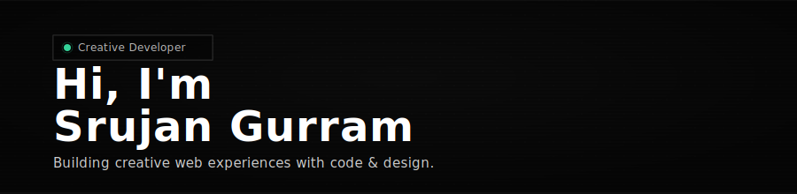

 

---

<table>
<tr><th colspan="3">⚡ Featured</th></tr>
<tr>
<td width="33%">

🧩 **[Syncia](https://github.com/Royal-lobster/Syncia)** &nbsp;·&nbsp; [Store](https://chrome.google.com/webstore/detail/syncia-power-of-chatgpt-o/bhdfllifdfodbkihgmahlfmddlmfdjak)
 Chrome extension — ChatGPT sidebar on any website

</td>
<td width="33%">

🗳️ **[BallotZero](https://github.com/Royal-lobster/BallotZero)** &nbsp;·&nbsp; [Live](https://ballot-zero.vercel.app)
 Trustless elections via DC-net — no backend, no trust

</td>
<td width="33%">

🍺 **[InstallKit](https://github.com/Royal-lobster/InstallKit)** &nbsp;·&nbsp; [Live](https://installkit.vercel.app)
 Select Mac apps → copy brew command → paste

</td>
</tr>
<tr>
<td>

🥁 **[BeatURL](https://github.com/Royal-lobster/beaturl)** &nbsp;·&nbsp; [Live](https://beaturl.vercel.app)
 Step sequencer — beats encoded in URLs

</td>
<td>

🎨 **[Covercons](https://github.com/Royal-lobster/Covercons)** &nbsp;·&nbsp; [Live](https://covercons.vercel.app)
 Generate cover images with icons

</td>
<td>

🎬 **[Watchlister](https://github.com/Royal-lobster/Watchlister)** &nbsp;·&nbsp; [Live](https://watchlister.vercel.app)
 Notion-powered watchlist manager

</td>
</tr>
<tr><th colspan="3">🌐 Web Apps</th></tr>
<tr>
<td width="33%">

📝 **[Notrix](https://github.com/Royal-lobster/Notrix)** &nbsp;·&nbsp; [Live](https://notrix.netlify.app)
 Browser note-taking app

</td>
<td width="33%">

📋 **[Copydock](https://github.com/Royal-lobster/Copydock)** &nbsp;·&nbsp; [Live](https://copydock.vercel.app)
 Paste sharing app

</td>
<td width="33%">

🌍 **[Transedit](https://github.com/Royal-lobster/Transedit)** &nbsp;·&nbsp; [Live](https://transedit.vercel.app)
 Review locale translations

</td>
</tr>
<tr>
<td>

🕐 **[Timeswitch](https://github.com/Royal-lobster/Timeswitch)** &nbsp;·&nbsp; [Live](https://timeswitch.vercel.app)
 Share events across timezones

</td>
<td>

✉️ **[Mailspread](https://github.com/Royal-lobster/Mailspread)** &nbsp;·&nbsp; [Live](https://mailspread.netlify.app)
 Generate email templates with forms

</td>
<td>

🎵 **[Savanic](https://github.com/Royal-lobster/Savanic)** &nbsp;·&nbsp; [Live](https://savanic.vercel.app)
 Music streaming app (Jio Saavn)

</td>
</tr>
<tr>
<td>

📈 **[Crypto-Pulse](https://github.com/Royal-lobster/Crypto-Pulse)** &nbsp;·&nbsp; [Live](https://crypto-currents-nu.vercel.app)
 Crypto dashboard & tracker

</td>
<td>

🤬 **[Bad-Words-Filter](https://github.com/Royal-lobster/Bad-Words-Filter)** &nbsp;·&nbsp; [Live](https://badwordsfilter.netlify.app)
 Profanity filter

</td>
<td></td>
</tr>
<tr><th colspan="3">🔗 Web3</th></tr>
<tr>
<td width="33%">

📄 **[ChainSheets](https://github.com/Royal-lobster/ChainSheets)**
 Decentralized academic publishing

</td>
<td width="33%">

🎓 **[Student-Records](https://github.com/Royal-lobster/Student-Records-Web3)** &nbsp;·&nbsp; [Live](https://student-records-web3.vercel.app)
 Student records on blockchain + IPFS

</td>
<td width="33%">

⚡ **[IQ-Storm](https://github.com/Royal-lobster/IQ-Storm)** &nbsp;·&nbsp; [Live](https://iq-storm.vercel.app)
 IQ brainstorming tool

</td>
</tr>
<tr><th colspan="3">🖥 Desktop & Tools</th></tr>
<tr>
<td width="33%">

😴 **[Lidsleep](https://github.com/Royal-lobster/Lidsleep)**
 macOS auto-sleep on lid close with external display

</td>
<td width="33%">

🚀 **[Respace](https://github.com/Royal-lobster/Respace-Raycast)**
 Raycast extension — launch apps/folders in bundles

</td>
<td width="33%">

🌙 **[Google-Calendar-Dark](https://github.com/Royal-lobster/Google-Calendar-Dark)**
 Electron Google Calendar with dark mode

</td>
</tr>
<tr>
<td>

🔬 **[Science Facts API](https://github.com/Royal-lobster/science-facts-api)** &nbsp;·&nbsp; [Dataset](https://huggingface.co/datasets/Royal-lobster/100001-Science-Facts)
 REST API + Telegram bot · 10k+ facts

</td>
<td>

🎧 **[Searchitunes](https://github.com/Royal-lobster/Searchitunes)**
 Song preview app (iTunes API)

</td>
<td>

☕ **[Appletrun](https://github.com/Royal-lobster/Appletrun)**
 Run Java applets from file

</td>
</tr>
</table>

---

### ✍️ Latest Blog Posts

<!-- BLOG:START -->
| Post | Description | Date |
|------|-------------|------|
| [Anonymous Votes with Nothing but Math](https://srujangurram.me/blog/anonymous-votes-with-math) | How I built a trustless voting system where no one — not even the organizer — ca... | Feb 14, 2026 |
| [Why None of My Apps Have a Database](https://srujangurram.me/blog/no-database-apps) | Many of my hobby projects have zero databases — how URLs, browsers, and other pe... | Feb 10, 2026 |
| [How I Squeezed Drum Beats into URLs](https://srujangurram.me/blog/drum-beats-in-urls) | Fitting an entire drum machine's state into a shareable URL with adaptive arithm... | Feb 09, 2026 |
<!-- BLOG:END -->

---

